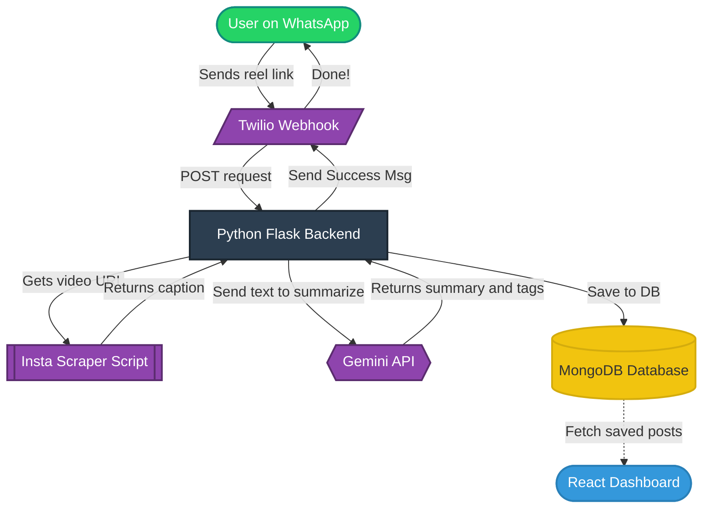

## The Social Bookmarker
**Your AI-Powered Content Curation Assistant via WhatsApp**
Ever find a highly valuable Instagram Reel or a Youtube short but lose it in your Saved reels? *The Social Bookmarker* solves this by allowing you to forward any Instagram link or a youtube short link to a WhatsApp bot. The system automatically extracts the caption, uses AI to tag, categorize, and summarize the content, and saves it to a web dashboard for your personal knowledge base.

## Demo Video
[)

## Architecture Diagram

## Key Features
- **Frictionless Capture:** Just forward links natively via WhatsApp.
- **Automated Extraction:** Pulls context and captions directly from the URL.
- **AI-Powered Organization:** Automatically categorizes content, extracts keywords, and generates summaries.
- **Searchable Dashboard:** Filter, search, and review all your saved knowledge in a clean UI.

## Tech Stack
- **Backend API:** Python, Flask
- **Messaging:** Twilio API for WhatsApp / Meta Cloud API
- **AI capabilities:** Gemini API (for summaries and classification)
- **Database:** (Insert your DB here, e.g., PostgreSQL, MongoDB)
- **Frontend Dashboard:** (Insert your frontend tech here, e.g., React, Next.js, HTML/CSS)

